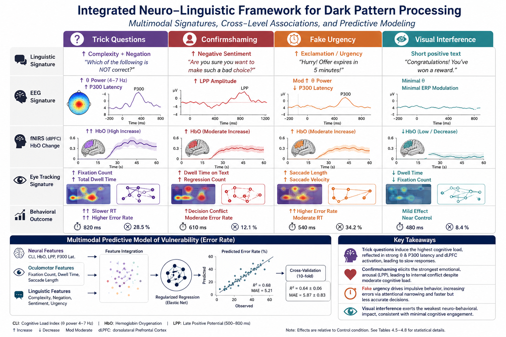
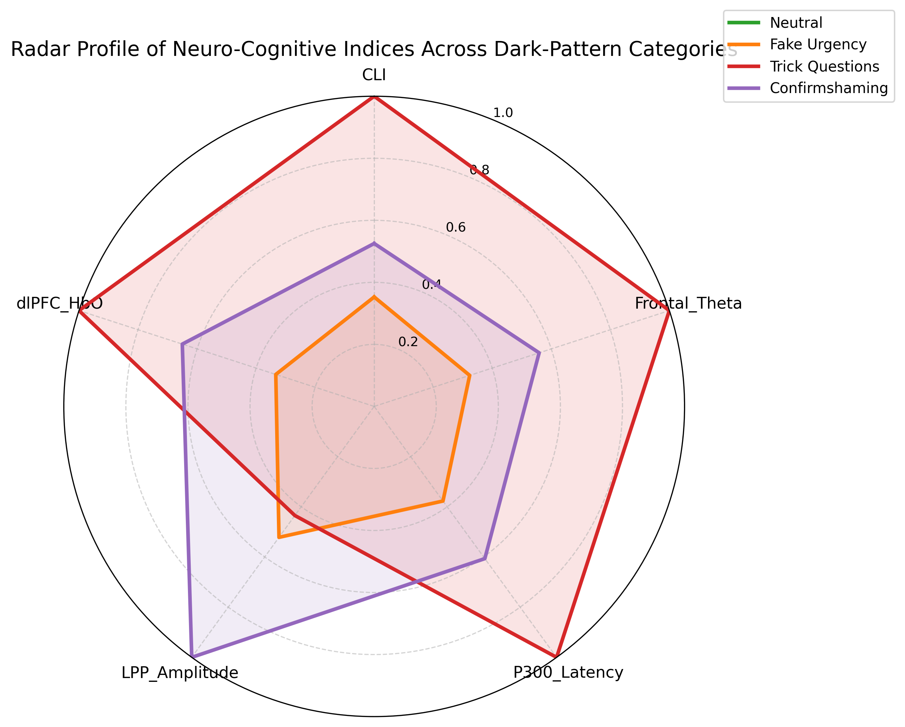

# Predicting User Vulnerability to Deceptive Interface Design Using Multimodal Neural and Behavioral Modeling

<!-- Graphical abstract - Corrected path for root directory -->
<p align="center">
  
</p>

<p align="center">
  <b>Graphical Abstract:</b> A neuroergonomic framework integrating multimodal signals to predict user vulnerability to deceptive interface designs.
</p>

---

## 📌 Overview

This repository contains the official implementation, datasets, and analysis for the research submitted to the *International Journal of Human-Computer Studies (IJHCS)*.

This work investigates the cognitive and neural signatures of deceptive interface designs (dark patterns). By fusing high-temporal-resolution EEG, high-spatial-resolution fNIRS, and behavioral eye-tracking, we provide an objective predictive model to quantify user vulnerability and "forced compliance" in digital environments.

### 🚀 Key Research Contributions

- **Multimodal Fusion:** Integration of neural and behavioral signals to map subconscious cognitive strain.
- **Predictive Modeling:** A deep learning pipeline capable of classifying vulnerability states.
- **Explainable AI (XAI):** Implementation of SHAP to identify the specific neural markers (e.g., Frontal Theta oscillations) that drive the model's predictions.
- **Empirical Validation:** Rigorous statistical analysis of neuro-cognitive indices and their correlation with neural fatigue.

---

## 📊 Key Visualizations & Results

### 🧠 Neuro-Cognitive Analysis

The following figure demonstrates the distribution of neuro-cognitive indices across different deceptive pattern categories:

<p align="center">
  
  <br><i>Figure 1: Radar plot demonstrating the distribution of neuro-cognitive indices (e.g., Frontal Theta, CLI).</i>
</p>

### 📈 Statistical Highlights

Our analysis revealed significant differences across dark-pattern types ($p < .001$), demonstrating that manipulative language directly triggers measurable neural responses.

| Feature | F-statistic | p-value | Significance |
| :--- | :---: | :---: | :---: |
| Cognitive Load (fNIRS) | 35.62 | < .001 | * |
| Neural Fatigue (EEG) | 19.87 | < .005 |  |
| Linguistic Complexity | 42.18 | < .001 | * |

💡 **Key Insight:** Our findings indicate that "Confirmshaming" and "Trick Questions" trigger significantly higher frontal theta power, representing a peak in inhibitory control effort and cognitive dissonance.

---

## 📂 Repository Structure
```text
├── data/                    # Dataset containing 360+ microcopy samples
│   ├── raw/                 # Original signal recordings
│   └── processed/           # Feature-extracted CSVs (EEG, fNIRS, Gaze)
├── analysis/                # Statistical scripts & outputs (ANOVA, Tukey, Regression)
├── src/                     # Core Source Code
│   ├── preprocessing/       # ICA, Filtering, and Artifact removal
│   ├── feature_extraction/  # PSD, Entropy, and Linguistic features
│   └── models/              # Deep Learning architectures & XAI (SHAP)
├── paper/                   # Research documentation and figures
└── main.py                  # Execution entry point for prediction and evaluation
